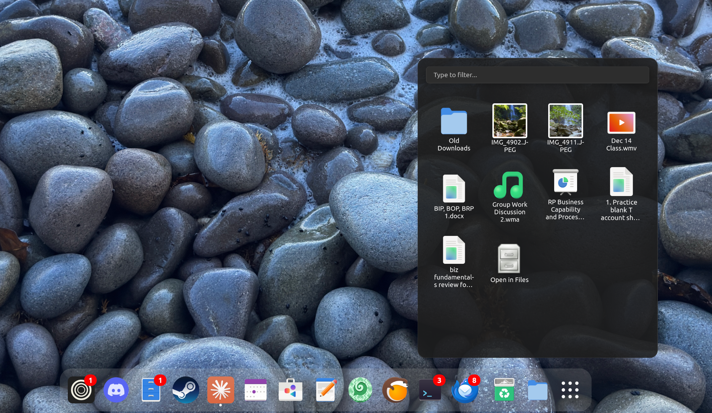

# Dock Stacks

macOS-style stacks for the GNOME Dash. Pin any folder to your dock and browse its contents in a fan or grid overlay — no file manager needed.

| Fan mode | Grid mode |
|----------|-----------|
|  |  |

## Features

- **Fan and grid layouts** — small folders fan out elegantly; larger ones switch to a searchable, scrollable grid
- **Search** — type to filter in grid mode to quickly find files
- **Quick Look** — press Spacebar to preview any file with GNOME Sushi, works in both fan and grid mode
- **Drag and drop** — drag files to the desktop or into Nautilus windows; dropping onto other apps opens the file with its default handler
- **Live previews** — image and video thumbnails render inline
- **Configurable** — choose folders to pin, set fan/grid thresholds, and more via the preferences panel
- **Lightweight** — no background processes, purely a GNOME Shell extension

> **Note on drag and drop:** Cross-app DnD (e.g. dragging a file directly into Discord or a browser) is not currently possible from GNOME Shell extensions — the compositor does not expose the APIs needed for cross-process drag on Wayland. This is a platform limitation, not a bug. I'm tracking upstream progress and will add full cross-app DnD as soon as GNOME/Mutter supports it. In the meantime, if you need this badly enough, I may build a standalone portal app to bridge the gap — [let me know](https://github.com/dragosol/dock-stacks/issues).

## Requirements

- GNOME Shell 49 or 50
- Wayland or X11

## Installation

### From extensions.gnome.org

Search for **Dock Stacks** on [extensions.gnome.org](https://extensions.gnome.org/) and click Install.

### Manual

```bash
git clone https://github.com/dragosol/dock-stacks.git
cd dock-stacks
cp -r . ~/.local/share/gnome-shell/extensions/dock-stacks@dragosr/
glib-compile-schemas schemas/
```

Then restart GNOME Shell (log out and back in on Wayland, or `Alt+F2 → r` on X11) and enable the extension:

```bash
gnome-extensions enable dock-stacks@dragosr
```

## Configuration

Open the extension preferences via GNOME Extensions app or:

```bash
gnome-extensions prefs dock-stacks@dragosr
```

| Setting | Description | Default |
|---------|-------------|---------|
| Configured Folders | Folder paths pinned to the dock | `[]` |
| Grid Mode | `auto`, `always`, or `never` | `auto` |
| Fan Threshold | Max items before switching to grid | `12` |

## Support

If you find Dock Stacks useful, consider supporting development:

[](https://www.paypal.com/donate?business=alexrobu.mac%40gmail.com&currency_code=CAD)

## License

GPL-2.0-or-later
